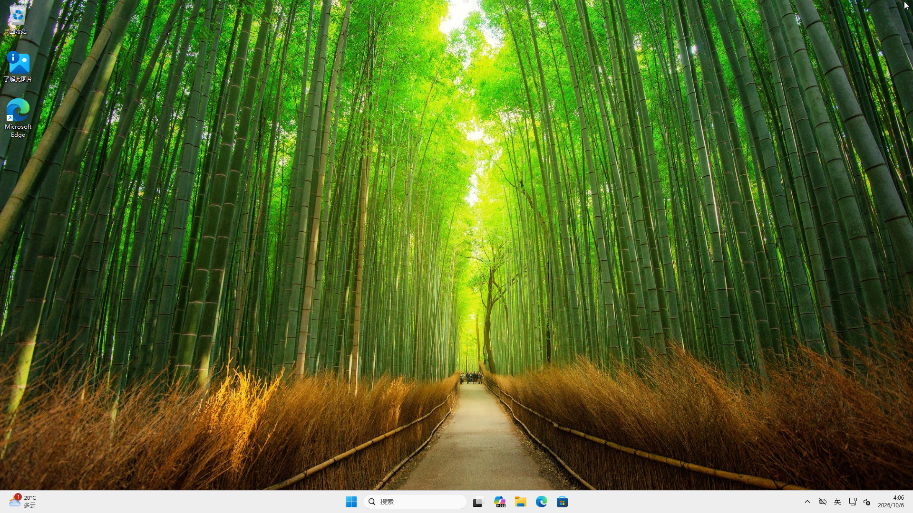
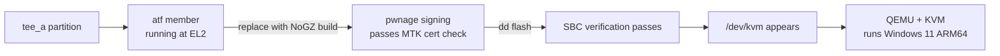

# Windows 11 ARM64 on an Android Phone — with Real KVM Hardware Acceleration

**English** | [中文](README.md)

> Verified on Redmi Note 11T Pro / Pro+ (MT6895 / Dimensity 8100).
> **No custom ROM, no reflashing your daily system — stay on Android and still run VMs.**



---

## The principle, in one sentence

On MediaTek devices `/dev/kvm` does not exist because **EL2 is occupied by MediaTek's
GenieZone (GZ) firmware**. Replace the **ATF** that runs at EL2 inside the `tee_a`
partition with a **NoGZ-patched build** (signed so it passes MTK's certificate check),
and EL2 is handed over to Linux → **`/dev/kvm` appears** → **QEMU can use KVM**.



**Why signing is mandatory**: on this device `sbc_en = 1` (Secure Boot is on, and the
value comes from eFuse OTP — it cannot be changed), so every boot walks the ATF
certificate chain. A modified ATF is therefore **only accepted if it is signed with
[pwnage24mtk](https://github.com/kasnria001/pwnage24mtk)'s certificate-parsing
vulnerability**. See [docs/01](docs/01-enable-kvm.md) and
[docs/02](docs/02-build-and-sign.md) (both currently in Chinese).

---

## ⚠️ Two things you must know before starting

### 1. Root is required (there is no way around it)

To make QEMU on Android use **KVM** hardware acceleration, you must replace the ATF
firmware running at EL2 in the device's `tee` partition. That requires:

- ✅ **Unlocked bootloader**
- ✅ **Root** (KernelSU / Magisk, with `adb shell` granted root)
- ✅ **adb** and **Python 3.10+** on your PC

> **No root means no KVM.** The "no-root VM" guides you find online use
> **TCG (pure software emulation)** — roughly **1/10 to 1/50** the speed of KVM.
> Installing an OS takes hours and it is unusable day to day.
> **This project is KVM-only. TCG is out of scope by design.**

### 2. It modifies your device's boot trust chain

Replacing ATF is a **boot-chain modification**. Everything here was verified on real
hardware, but you need to understand the following:

- **Always back up the stock `tee_a` first** (the one-click script enforces this and
  aborts if it cannot back up)
- **Only `tee_a` is modified; `tee_b` stays stock** — switching to slot B returns you
  to a no-KVM state, a built-in fallback
- **Do not use SP Flash Tool for a full flash** (it re-locks the bootloader)
- If you do brick it, **preloader mode** (no auth required) can still recover it
- **You are responsible for the consequences**

---

## Who this is for

| Your situation | Recommendation |
|---|---|
| **You want to stay on Android** and just run a Windows / ARM Linux VM | ✅ **This is the project** — see [Quick start](#quick-start) |
| You want **mainline Linux + KDE** (like the [kde-yyds](https://space.bilibili.com/2008726064) video) | See [docs/06-mainline.md](docs/06-mainline.md) |
| You do not have root | ❌ This project cannot help you (TCG is not discussed) |
| Your device is not MT6895 | ⚠️ The idea generalizes, but the `tee` patch needs your model's TEE/LK pair (see [docs/02](docs/02-build-and-sign.md)) |

---

## Quick start

### Step 1 — Enable KVM (one script)

```powershell
# Get the two tools (both are separate downloads)
git clone https://github.com/MT6895-Mainline/mtk-mod-tee-nogz   D:\mtk-mod-tee-nogz
git clone https://github.com/kasnria001/pwnage24mtk             D:\pwnage24mtk

# Install mtk-mod-tee-nogz's dependencies
cd D:\mtk-mod-tee-nogz
python -m venv .venv
.\.venv\Scripts\python.exe -m pip install -r requirements.txt

# Run everything: env check → backup → dump → build → sign → verify → flash → hints
cd <this repo>\scripts
.\kvm-oneclick.ps1 -Profile xaga -TeeFixRepo D:\mtk-mod-tee-nogz -PwnageDir D:\pwnage24mtk
```

The script walks through these stages, **printing and verifying at every step**:

```
[1] environment check   adb / python / device / bootloader unlock / root
[2] read-only recon     model, partitions, current /dev/kvm state, sbc_en from expdb
[3] back up stock       tee_a / tee_b / lk_a / lk_b / preloader_raw_a / seccfg → PC
[4] dump inputs         TEE / LK / preloader straight off the device (hash match guaranteed)
[5] build + sign        drives mtk-mod-tee-nogz (auto-detects new/legacy mode)
[6] verify              requires 2× "Result: VALID"; trims trailing zero padding to partition size
[7] flash tee_a         dd + read back and compare sha256
[8] reboot hints        /dev/kvm, "[SBC] image atf header auth pass"
```

**Want to look before you leap?** Add `-DryRun` — it goes all the way through step 6 and
leaves the ready-to-flash image on disk without touching the device.

After rebooting, verify:

```bash
adb shell su -c 'ls -l /dev/kvm'
adb shell su -c 'cat /proc/misc | grep kvm'
```

> ### ⚠️ The first boot after flashing hangs at the second screen for ~2 minutes — that is NOT a brick
>
> Measured: **150 seconds** from reboot to `sys.boot_completed=1`, with 120 seconds of a
> completely static screen in between. Afterwards `/dev/kvm` shows up normally ✓
>
> **Do not** press Volume Down + Power to enter fastboot at that moment ✗ —
> **it interrupts the boot** and turns a boot that would have succeeded into one that really
> does not ✗. **Wait 3 minutes** ✓
>
> Telling them apart: **second screen + device visible in adb = normal, wait** ✓;
> **first screen, or a black screen falling into fastboot = real failure** ✗.
> See [docs/05](docs/05-gotchas.md) item 12.

> **Don't want to build it yourself?** Prebuilt, signed images live in
> [`tee/`](tee/) with the exact base-firmware hash each one targets — and
> `bash tee/verify.sh` tells you which one (if any) is safe for your device.
> **A patch is bound to one `tee` base — use the one built for yours.**
> ⚠️ Also note: **the first boot after flashing a patch hangs at the second screen for about
> 2 minutes** — that is normal, not a brick. Don't rush into fastboot.

### Step 2 — Build a Windows 11 ARM64 disk (one script)

No hypervisor install, no running the installer inside a VM — a bootable VHDX is built
straight from the ISO, entirely from the command line:

```powershell
# Extract the ARM64 virtio drivers (needs 7-Zip)
.\extract-virtio.ps1 -Iso D:\virtio-win.iso -OutDir .\virtio-arm64-w11

# Build the disk straight from a Windows 11 ARM64 ISO
# (run in an ADMIN PowerShell)
.\build-windows-vhdx.ps1 -Iso D:\Win11_ARM64.iso -DriversDir .\virtio-arm64-w11
```

The script handles: partitioning → `dism /Apply-Image /Compact:ON` → **`bcdboot` to write
the boot files** → **LabConfig to bypass TPM checks** → **driver injection** → verifying
`bootmgfw.efi` is actually ARM64.

> ⚠️ The easiest trap here: disks produced by tools like Dism++ have an **empty ESP**, so
> you must run `bcdboot` yourself or the firmware finds no bootable device.

### Step 3 — Push it to the phone and boot

```bash
# Push the on-device scripts first (they live in scripts/phone/)
adb push scripts/phone/boot-win.sh scripts/phone/stop-vm.sh scripts/phone/restore-disk.sh /data/local/tmp/
adb shell su -c 'chmod 755 /data/local/tmp/*.sh'

# Put the disk in place (restore-disk.sh checks format and free space, then verifies sha256)
adb push win.vhdx /data/local/tmp/win.vhdx
adb shell su -c 'sh /data/local/tmp/restore-disk.sh /data/local/tmp/win.vhdx'

# Boot (the script waits for port 5900 and re-checks the actual port afterwards)
adb shell su -c 'sh /data/local/tmp/boot-win.sh'
adb forward tcp:5900 tcp:5900                    # VNC is pinned to 5900
# Point your VNC client at 127.0.0.1:5900 (no password)
```

> Lost your disk or moving to a new one? Just run `restore-disk.sh <image>` — it detects
> VHDX / QCOW2 / VHD, checks free space on `/data`, asks before overwriting, and finally
> verifies with sha256.

The first boot runs OOBE and takes 5–15 minutes. On the network page, choose
**"I don't have internet"** → **"Continue with limited setup"** to create a local account —
that is the least painful path.

---

## Repository map

| Path | Contents |
|---|---|
| [docs/01-enable-kvm.md](docs/01-enable-kvm.md) | **Full KVM enablement**: the principle, verification-chain analysis, flashing and validation |
| [docs/02-build-and-sign.md](docs/02-build-and-sign.md) | **Build & signing walkthrough**: what the NoGZ patch changes, how pwnage signs, handling oversized images |
| [docs/03-windows-vm.md](docs/03-windows-vm.md) | The Windows 11 ARM64 disk: applying the image, writing boot files, bypassing TPM, injecting drivers |
| [docs/04-usage.md](docs/04-usage.md) | **Usage**: every QEMU flag explained, VNC, networking, performance tuning |
| [docs/05-gotchas.md](docs/05-gotchas.md) | **Gotcha list** — every trap we actually hit |
| [docs/06-mainline.md](docs/06-mainline.md) | Going further: mainline Linux + KDE on the same device |
| [tee/](tee/) | **Prebuilt signed `tee` images** + the base-firmware compatibility table + `verify.sh` |
| [profiles/](profiles/) | Firmware profiles (ATF/LK offset definitions) |
| [tools/](tools/) | Reverse-engineering tools to re-locate offsets for new firmware |
| [scripts/](scripts/) | One-click scripts (build VHDX / extract drivers / enable KVM) |
| [scripts/phone/](scripts/phone/) | **On-device scripts**: `boot-win.sh`, `stop-vm.sh`, `restore-disk.sh`, `qemu-wrapper.sh` |

> 📖 The in-depth docs under `docs/` are currently written in Chinese. The READMEs, the
> scripts and all script output are bilingual or English-friendly, and the scripts are
> heavily commented — issues and PRs with translations or fixes are very welcome.

---

## FAQ

**Q: Why can't I connect to VNC?**

Two separate cases — don't mix them up:

**① Launching via this project's `boot-win.sh` (the command-line route)**
> In QEMU's `-vnc host:N`, `N` is the **display number** and the port is `5900 + N`.
> Writing `-vnc :5900` actually listens on **11800**, not 5900.
> Worse, when the port is taken QEMU **does not error — it silently moves to the next
> display** (→ 5901). That is why `scripts/phone/boot-win.sh` waits for the port to free
> up and then re-checks which port QEMU actually bound.

**② Launching via DroidVM's own config**
> There are two more traps here:
> - `screens.*.vnc.port` defaults to **`-1`**, meaning "pick one automatically" — so
>   **the port can differ on every launch**, and whatever you forwarded with
>   `adb forward tcp:5900` has nothing listening on it
> - Configs created inside the app **don't work on their own** (no `-netdev`, no balloon —
>   they need a wrapper script to patch the arguments), while **hand-editing `vms.json`
>   makes the app unable to read it**
>
> **That is why this project just uses the command-line route**: port pinned to 5900,
> full control over every argument. See [scripts/phone/README.md](scripts/phone/README.md).

**Q: Does Windows get GPU acceleration?**
> **No — that is a hard limit.** virtio-win's `viogpudo` is a display driver with
> **no 3D capability**, and Windows has no virgl driver (that is Linux-only). So the
> Windows guest is always software-rendered. For a GPU-accelerated VM you need the
> [mainline Linux route](docs/06-mainline.md) with a Linux guest.

**Q: It feels laggy — what should I tune?**
> It is mostly about the **display path**. Adding `-vnc ...,lossy=on` cuts the per-frame
> payload from 3.0 MB down to **0.36 MB (1/8.3)**. We also measured the adb forward tunnel
> at **276 MB/s**, so the network is not the bottleneck — don't waste time tuning it.
> See [docs/04](docs/04-usage.md).

**Q: Can I do this without root?**
> No. Without root you cannot modify `tee_a`, and without that there is no KVM.
> See the warning above.

**Q: Can I use a different Windows version?**
> You need an **ARM64** build of Windows. x64 Windows on ARM is emulation-only (extremely
> slow) and not worth attempting.

**Q: Will patching `tee` break app integrity checks (banking apps, Play Integrity, DRM)?**
> **No — we tested it.** The patch only changes **who owns EL2**; it does not touch the
> **TEE**. Measured on a stock-vs-patched A/B pair with identical results: KeyMint
> hardware-backed key attestation, Gatekeeper, Widevine/DRM, fingerprint and face, and
> Secure Element **all keep working**.
>
> Also worth separating two things: **`verifiedbootstate = orange` (unlocked bootloader) is
> already the Play Integrity killer**, independent of `tee` — those checks already fail
> today, so patching cannot make them worse. Full measurements are in
> [tee/README.en.md](tee/README.en.md).

---

## Credits

- [`MT6895-Mainline`](https://github.com/MT6895-Mainline) — the mainline port for this
  device, and upstream of the NoGZ patch tooling
- [`mtk-mod-tee-nogz`](https://github.com/MT6895-Mainline/mtk-mod-tee-nogz) — build/sign
  tooling for the ATF NoGZ patch (this project's one-click script wraps it)
- [`kasnria001/pwnage24mtk`](https://github.com/kasnria001/pwnage24mtk) — MTK certificate
  signing bypass
- [kde-yyds](https://space.bilibili.com/2008726064) — mainline Linux progress on the same
  device, and the inspiration for this project

## License

[MIT](LICENSE) for the code, scripts and documentation in this repository.

> The vendor firmware images under [`tee/`](tee/) contain binaries and certificate chains
> originating from MediaTek and the device vendor; they are **not** covered by the MIT
> license and are provided only for interoperability research on hardware you own.
> See the note at the end of [LICENSE](LICENSE).
