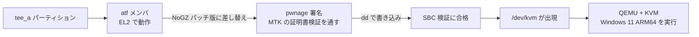

# Android スマホで Windows 11 ARM64 を動かす —— 本物の KVM ハードウェア支援で

[中文](README.md) | [English](README.en.md) | **日本語** | [Русский](README.ru.md)

> Redmi Note 11T Pro / Pro+（MT6895 / Dimensity 8100）で実機検証済み。
> **ROM を焼き直す必要も、OS を入れ替える必要もありません。Android のまま仮想マシンを動かせます。**


---

## ⚠️ 始める前に必ず知っておくべき 2 つのこと

### 1. root 権限が必要（回避不可）

Android 上の QEMU で **KVM** ハードウェア支援を使うには、デバイスの `tee` パーティション内で
EL2 で動いている ATF ファームウェアを差し替える必要があります。必要なもの：

- ✅ **ブートローダーのアンロック済み**
- ✅ **root 取得済み**（KernelSU / Magisk、かつ adb shell に root を許可）
- ✅ PC に **adb** と **Python 3.10+**

> **root が無ければ KVM は無理です。** ネット上にある「root 不要で仮想マシン」系の方法は
> **TCG（純ソフトウェアエミュレーション）** で、速度は KVM の **1/10 ～ 1/50** 程度。
> OS のインストールに何時間もかかり、日常用途にはとても耐えません。
> **本プロジェクトは KVM 専用です。TCG は対象外です。**

### 2. デバイスの信頼チェーンを書き換えます

ATF の差し替えは**起動チェーンの改変**です。本プロジェクトは全て実機で成功していますが、
以下は理解しておいてください：

- **必ず純正の `tee_a` をバックアップすること**（ワンクリックスクリプトが強制します。取れなければ中断します）
- **書き換えるのは `tee_a` のみ。`tee_b` は純正のまま** —— B スロットに切り替えれば KVM 無しの状態に戻れる、天然の保険です
- **SP Flash Tool での全書き換えはしないこと**（ブートローダーが再ロックされます）
- 壊してしまっても **preloader モード**（認証不要）で復旧できる可能性があります
- **全て自己責任で**

---

## どんな人向けか

| あなたの状況 | おすすめ |
|---|---|
| **Android のまま**、Windows / ARM Linux の VM を動かしたいだけ | ✅ **まさに本プロジェクト** —— [クイックスタート](#クイックスタート)へ |
| **メインライン Linux + KDE** をやりたい（[kde-yyds](https://space.bilibili.com/2008726064) の動画と同じ） | [docs/ja/06-mainline.md](docs/ja/06-mainline.md) を参照 |
| root が無い | ❌ 本プロジェクトでは無理です（TCG は対象外） |
| MT6895 以外のデバイス | ⚠️ 原理は共通ですが、`tee` パッチは各機種の TEE/LK の組み合わせが必要です（[docs/02](docs/ja/02-build-and-sign.md)） |

---

## 原理を一言で

MTK デバイスに `/dev/kvm` が存在しないのは、**EL2 が MediaTek の GenieZone（GZ）ファームウェアに
占有されている**からです。`tee_a` の中で EL2 で動いている **ATF** を **NoGZ パッチ版**に差し替え
（かつ MTK の署名検証を通し）、**EL2 を Linux に渡す** → `/dev/kvm` が現れる → QEMU が KVM を使える。



**なぜ署名が必須なのか**：実機で `sbc_en = 1` を確認済み（Secure Boot が有効。値は eFuse OTP 由来で変更不可）。
起動のたびに ATF の証明書チェーンが検証されるため、改変した ATF は
**[pwnage24mtk](https://github.com/kasnria001/pwnage24mtk) の証明書パース脆弱性を使って署名**しないと
受け入れられません。詳細は [docs/01](docs/ja/01-enable-kvm.md) と [docs/02](docs/ja/02-build-and-sign.md)。

---

## 🎁 自分でビルドしたくない場合は完成品をどうぞ

リポジトリには**すでにビルドと署名が済んだ** `tee` イメージが置いてあり、そのまま書き込めます ——
その中には**実機で動作確認済みの例**も含まれます：

| ファイル | 対応ベース（あなたの `tee_a`） | 実機検証 |
|---|---|---|
| [`tee/tee_nogz_rk_5M.img`](tee/tee_nogz_rk_5M.img) | `f8f286f1…`（純正） | ✅ **成功**（Android 15 → 16 をまたいで 2 回確認）|
| [`tee/tee_nogz_shuilanA15_5M.img`](tee/tee_nogz_shuilanA15_5M.img) | `a91f5ded…`（ROM 更新後） | ✅ **成功**（2026-10-06 実測）|

**書き込む前に自己診断を実行してください** —— どれを使うべきか（あるいは自分でビルドが必要か）を
直接教えてくれます：

```bash
bash tee/verify.sh                 # 接続中のデバイスを自動検出
bash tee/verify.sh <serial>        # デバイスを指定
```

デバイスの `tee_a` / `tee_b` を出力し、**未パッチ / パッチ済み / 自分でビルドが必要** の 3 状態を
判別します。

⚠️ **パッチは `tee` ベースごとにビルドされています** —— 同じベースのものを使うのが推奨です（より保守的で変数が少ない）。
> **ただしベース違いでも起動します** ✓（2026-10-07 に実測）。まず 1〜2 分止まるだけなので、3 分待ってください。
>
> ⚠️ **書き込み後は毎回の起動で 2 回目の画面が約 2 分停止**してからシステムに入ります ——
> これは正常で、**文鎮ではありません。待てば大丈夫です**。
> 慌てて fastboot に入らないでください。起動を中断させてしまいます。
>
> ⚠️ **書き込むと普段使いのアプリ整合性チェック（銀行アプリ / Play Integrity / DRM）に
> 影響するのか？ 実測の答えは「しない」です** —— パッチは EL2 の所有権を変えるだけで、
> TEE には触れません。実測データ、ベース対応表、ロールバック手順は
> [`tee/README.ja.md`](tee/README.ja.md) にあります。

---

## クイックスタート

### ステップ 1：KVM を有効にする（ワンクリックスクリプト）

```powershell
# 2 つのツールを用意（どちらも別途ダウンロード）
git clone https://github.com/MT6895-Mainline/mtk-mod-tee-nogz   D:\mtk-mod-tee-nogz
git clone https://github.com/kasnria001/pwnage24mtk             D:\pwnage24mtk

# mtk-mod-tee-nogz の依存関係をインストール
cd D:\mtk-mod-tee-nogz
python -m venv .venv
.\.venv\Scripts\python.exe -m pip install -r requirements.txt

# 一気に実行：環境確認 → バックアップ → dump → ビルド → 署名 → 検証 → 書き込み → 確認手順の表示
cd <本リポジトリ>\scripts
.\kvm-oneclick.ps1 -Profile xaga -TeeFixRepo D:\mtk-mod-tee-nogz -PwnageDir D:\pwnage24mtk
```

スクリプトは以下を実行し、**各段階で出力と検証**を行います：

```
[1] 環境チェック      adb / python / デバイス / BL アンロック / root
[2] 読み取り専用調査  機種、パーティション、/dev/kvm の現状、expdb から sbc_en を取得
[3] 純正のバックアップ tee_a / tee_b / lk_a / lk_b / preloader_raw_a / seccfg → PC
[4] 材料の dump       デバイスから TEE/LK/preloader を吸い出す（ハッシュ一致を保証）
[5] ビルド + 署名     mtk-mod-tee-nogz を呼び出す（new/legacy を自動判別）
[6] 検証              「Result: VALID」が 2 回必要。末尾のゼロ詰めをパーティションサイズまで削る
[7] tee_a へ書き込み  dd + 読み戻して sha256 を突き合わせ
[8] 再起動と確認手順  /dev/kvm、[SBC] image atf header auth pass
```

**書き込まずに結果だけ見たい場合**：`-DryRun` を付けると、ステップ 6 まで進めて
書き込み用イメージをディスクに残したまま停止します。

書き込み後に再起動して確認：

```bash
adb shell su -c 'ls -l /dev/kvm'
adb shell su -c 'cat /proc/misc | grep kvm'
```

> ### ⚠️ 書き込み後は**毎回の起動で 2 回目の画面が約 2 分停止**します —— 文鎮ではありません（初回だけではありません）
>
> 実測：再起動から `sys.boot_completed=1` まで**合計 150 秒**、そのうち 120 秒は画面が
> まったく変化しません。完了後は `/dev/kvm` が正常に現れます ✓
>
> **このタイミングで音量下 + 電源を押して fastboot に入ってはいけません** ✗ ——
> **起動を中断してしまい**、本来成功するはずの初回起動を本当に起動不能にします ✗。
> **3 分待ってください** ✓
>
> 見分け方：**2 回目の画面 + adb にデバイスが見える = 正常、待つ** ✓；
> **1 回目の画面で止まる、またはブラックアウト後に fastboot へ落ちる = 本当の失敗** ✗。
> 詳細は [docs/05](docs/ja/05-gotchas.md) の第 12 項。

### ステップ 2：Windows 11 ARM64 のディスクを作る（ワンクリックスクリプト）

仮想マシンをインストールする必要も、VM 内でインストーラーを走らせる必要もありません。
コマンドラインだけで ISO から直接起動可能な VHDX を作れます：

```powershell
# virtio の ARM64 ドライバを抽出（7-Zip が必要）
.\extract-virtio.ps1 -Iso D:\virtio-win.iso -OutDir .\virtio-arm64-w11

# Windows 11 ARM64 の ISO から直接ディスクを作成
# （管理者 PowerShell で実行）
.\build-windows-vhdx.ps1 -Iso D:\Win11_ARM64.iso -DriversDir .\virtio-arm64-w11
```

スクリプトが自動で行うこと：パーティション作成 → `dism /Apply-Image /Compact:ON` →
**`bcdboot` でブートファイルを書き込み** → **LabConfig で TPM チェックを回避** →
**ドライバ注入** → `bootmgfw.efi` が ARM64 であることを検証。

> ⚠️ ここで最もハマりやすい罠：Dism++ などで展開したディスクは **ESP が空**です。
> 自分で `bcdboot` を実行しないと、ファームウェアが起動可能なデバイスを見つけられません。

### ステップ 3：スマホに転送して起動する

```bash
# まずスマホ側スクリプトを転送（scripts/phone/ にあります）
adb push scripts/phone/boot-win.sh scripts/phone/stop-vm.sh scripts/phone/restore-disk.sh /data/local/tmp/
adb shell su -c 'chmod 755 /data/local/tmp/*.sh'

# ディスクを所定の位置に配置（restore-disk.sh が形式・空き容量・sha256 を確認）
adb push win.vhdx /data/local/tmp/win.vhdx
adb shell su -c 'sh /data/local/tmp/restore-disk.sh /data/local/tmp/win.vhdx'

# 起動（ポート 5900 が空くのを待ち、起動後に実際のポートを再確認します）
adb shell su -c 'sh /data/local/tmp/boot-win.sh'
adb forward tcp:5900 tcp:5900                    # VNC は 5900 に固定
# VNC クライアントで 127.0.0.1:5900 に接続（パスワード無し）
```

> ディスクを失った／新しいディスクに移行する場合は `restore-disk.sh <イメージ>` を実行するだけです。
> VHDX / QCOW2 / VHD を自動判別し、`/data` の空き容量を確認し、上書き前に確認し、
> 最後に sha256 で検証します。

初回起動では OOBE が走り、5～15 分かかります。「ネットワークに接続」の画面で
**「インターネットに接続していません」** → **「制限付きセットアップを続行」** を選んで
ローカルアカウントを作るのが一番楽です。

---

## リポジトリ案内

| ファイル | 内容 |
|---|---|
| [README.en.md](README.en.md) | 英語版 README |
| [README.ru.md](README.ru.md) | ロシア語版 README |
| [docs/ja/01-enable-kvm.md](docs/ja/01-enable-kvm.md) | **KVM 有効化の全手順**：原理、検証チェーンの解析、書き込みと確認 |
| [docs/ja/02-build-and-sign.md](docs/ja/02-build-and-sign.md) | **ビルドと署名の詳細**：NoGZ パッチが何を変えるか、pwnage での署名、サイズ超過の扱い |
| [docs/ja/03-windows-vm.md](docs/ja/03-windows-vm.md) | Windows 11 ARM64 のディスク：イメージ展開、ブートファイル、TPM 回避、ドライバ注入 |
| [docs/ja/04-usage.md](docs/ja/04-usage.md) | **使い方**：QEMU の各オプション解説、VNC、ネットワーク、性能チューニング |
| [docs/ja/05-gotchas.md](docs/ja/05-gotchas.md) | **落とし穴リスト**（12 項目、すべて実際に踏んだもの） |
| [docs/ja/06-mainline.md](docs/ja/06-mainline.md) | 発展編：メインライン Linux + KDE への道 |
| [tee/](tee/) | **完成済み `tee` イメージ**（署名済み、直接書き込み可）+ 対応ベース一覧 |
| [profiles/](profiles/) | ファームウェアプロファイル（ATF/LK のオフセット定義） |
| [tools/](tools/) | 新しいファームウェア向けにオフセットを再特定するリバースエンジニアリングツール |
| [scripts/](scripts/) | ワンクリックスクリプト（VHDX 作成 / ドライバ抽出 / KVM 有効化） |
| [scripts/phone/](scripts/phone/) | **スマホ側スクリプト**：`boot-win.sh` 起動 / `stop-vm.sh` 停止 / `restore-disk.sh` ディスク復元 / `qemu-wrapper.sh` DroidVM アプリでも動かす |

---

## よくある質問

**Q: VNC に接続できません**

2 つのケースを分けて考えてください。

**① 本プロジェクトの `boot-win.sh` で起動した場合（コマンドライン経路）**
> QEMU の `-vnc host:N` の `N` は **display 番号**で、ポートは `5900 + N` です。
> `-vnc :5900` と書くと実際には **11800** をリッスンします（5900 ではありません）。
> さらにポートが埋まっていると QEMU は**エラーを出さずに次の display へ静かに移動**します（→ 5901）。
> そのため `scripts/phone/boot-win.sh` はポートが空くのを待ち、起動後に実際のポートを再確認します。

**② DroidVM アプリ自身の設定で起動した場合**
> ここにはさらに 2 つの罠があります：
> - `vms.json` の `screens.*.vnc.port` の既定値は **`-1`**、つまり「自動で選ぶ」
>   —— **起動のたびにポートが変わり得ます** ✗。`adb forward tcp:5900` した先には誰もいません
> - アプリが作る設定は**それ自体では起動できません**（`-netdev` と balloon が欠けており、
>   ラッパースクリプトで補う必要があります）。そして**`vms.json` を手で編集するとアプリが読めなくなります** ✗
>
> **そこで本プロジェクトはコマンドライン経路を使います**：ポートは 5900 固定、引数は完全に制御可能。
> 詳細は [scripts/phone/README.md](scripts/phone/README.md)。

**Q: Windows に GPU アクセラレーションは効きますか？**
> **効きません。これは構造上の制約です。** virtio-win の `viogpudo` は表示ドライバであり
> **3D 機能はありません**。Windows 用の virgl ドライバも存在しません（あれは Linux 用です）。
> したがって Windows ゲストは常にソフトウェアレンダリングです。
> GPU 加速された VM が欲しければ [メインライン Linux 経路](docs/ja/06-mainline.md) + Linux ゲストになります。

**Q: 動作が重いのですが**
> 主に**表示経路**の問題です。`-vnc ...,lossy=on` を付けると 1 フレームあたりのデータ量が
> 3.0 MB から **0.36 MB（1/8.3）** に減ります。また adb 転送トンネルは実測 **276 MB/s** あるので、
> ネットワーク自体はボトルネックではありません —— そこを弄っても無駄です。
> 詳細は [docs/04](docs/ja/04-usage.md)。

**Q: root 無しでできますか？**
> できません。root が無ければ `tee_a` を変更できず、KVM も得られません。上の警告を参照。

**Q: 別の Windows バージョンは使えますか？**
> **ARM64** 版の Windows が必要です。x64 版は ARM 上ではソフトウェアエミュレーションのみ
> （極端に遅い）で、意味がありません。

**Q: `tee` を書き換えるとアプリの整合性チェック（銀行アプリ / Play Integrity / DRM）に影響しますか？**
> **しません。実測済みです。** パッチが変えるのは **EL2 の所有権**だけで、**TEE には触れません**。
> 未書き換え / 書き換え済みの A/B 比較で、KeyMint のハードウェア鍵証明、Gatekeeper、
> Widevine/DRM、指紋と顔認証、Secure Element は**すべて正常**でした。
>
> また区別すべき点：**`verifiedbootstate = orange`（BL アンロック）は元々 Play Integrity の
> 致命傷**であり、`tee` の書き換えとは無関係です —— 元から通っていない状態なので、
> 書き換えでさらに悪くなることはありません。
> 詳細な実測データは [tee/README.md](tee/README.md) の該当節にあります。

---

## 謝辞

- [`MT6895-Mainline`](https://github.com/MT6895-Mainline) —— 本機のメインライン移植プロジェクトであり、NoGZ パッチツールの上流
- [`mtk-mod-tee-nogz`](https://github.com/MT6895-Mainline/mtk-mod-tee-nogz) —— ATF NoGZ パッチのビルド/署名ツール（本プロジェクトのワンクリックスクリプトがこれを包んでいます）
- [`kasnria001/pwnage24mtk`](https://github.com/kasnria001/pwnage24mtk) —— MTK 証明書署名のバイパスツール
- [kde-yyds](https://space.bilibili.com/2008726064) —— 同機でのメインライン Linux 進捗記録。本プロジェクトの着想元

## ライセンス

本リポジトリの**コード、スクリプト、ドキュメント**は [MIT ライセンス](LICENSE) です。

> ⚠️ [`tee/`](tee/) 以下のベンダーファームウェアイメージ（MediaTek およびデバイスベンダーの
> バイナリと証明書チェーンを含む）は **MIT ライセンスの対象外**です。
> ご自身が所有するハードウェア上での相互運用性研究の目的でのみ提供されています。
