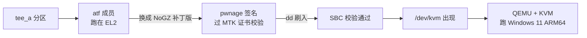

# 在 Android 手机上跑 Windows 11 ARM64 —— 用真正的 KVM 硬件加速

[**中文**](README.md) | [English](README.en.md) | [日本語](README.ja.md) | [Русский](README.ru.md)

> Redmi Note 11T Pro+ / **Redmi K50i**（MT6895 / Dimensity 8100）实测通过。
> 同 SoC 家族的 **Redmi Note 11T Pro / POCO X4 GT**（代号 `xaga`）原理完全相同，但固件不同，
> 需要各自的 profile（可以先备份后试成品 —— 跨基座已实测可启动）。
> **不用刷机、不用换系统、留在 Android 里就能玩虚拟机。**


---

## ⚠️ 开始之前必须知道的**三**件事

### 1. 需要 Root（不可绕过）

要让 Android 上的 QEMU 用 **KVM** 硬件加速，必须替换设备 `tee` 分区里跑在 EL2 的 ATF 固件。
这需要：

- ✅ **Bootloader 已解锁**
- ✅ **已 Root**（KernelSU / Magisk，且给 adb shell 授权）
- ✅ PC 上有 **adb** 和 **Python 3.10+**

> **没有 Root 就没有 KVM。** 网上那种"免 Root 跑虚拟机"的方案用的是 **TCG（纯软件模拟）** ——
> 速度大概是 KVM 的 **1/10 ~ 1/50**，装个系统要几小时，日常根本没法用。
> **本项目只做 KVM 路线，不做 TCG。**

### 2. 会改动设备信任链

替换 ATF 属于**修改启动链**的操作。虽然本项目全程实机验证成功，但你必须知道：

- **务必先备份原厂 `tee_a`**（一键脚本会强制备份，没备份就中止）
- **只改 `tee_a`，`tee_b` 保持原厂** —— 切到 B 槽就回到没 KVM 的状态，是天然兜底
- **不要用 SP Flash 深刷 `tee`**（会把 BL 重新锁上，后续 fastboot 就不方便了）
- **一切后果自负**

### 3. ⭐ 试 `tee` 之前，先把【工程 preloader】刷上 —— 这是唯一的免授权救砖路径

**这一点比备份还重要** ✗：

```
原厂 preloader ⇒ EDL 需要小米售后账号授权 ✗
              ⇒ tee 刷错、设备起不来时，你没有免授权的救援通道 ✗

工程 preloader ⇒ usbdl_verify_da 的返回值被直接丢弃
              ⇒ SLA / DAA 校验形同虚设
              ⇒ 可以用 SP Flash / mtkclient【免账号】写入 ✓
              ⇒ 这才是“刷坏了还能救”的前提 ✓
```

**刷工程 preloader（fastboot 即可，比刷 tee 简单得多）**：

```bash
fastboot flash preloader1 preloader_xaga.bin
fastboot flash preloader2 preloader_xaga.bin
fastboot reboot
```

（本机 by-name 里对应 `preloader_raw_a` / `preloader_raw_b`）

> ⚠️ **工程 preloader 只让“写入”免授权，不会关掉“启动时的镜像校验”** ✗
> `sbc_en` 仍然从 eFuse 读、实测值仍然是 **1**，ATF 每个启动都还在被校验 ✓
> 所以**改了 ATF 就必须签名**这一点不变 —— 详见 [docs/05](docs/05-gotchas.md) 与
> [appendix-atf-reverse](docs/appendix-atf-reverse.md)

**→ 推荐的完整顺序**：

```
① 确认可以刷入工程 preloader（手里有文件 + 能用 fastboot / SP Flash）
② 刷入工程 preloader 并验证能正常开机
③ 备份 tee_a / tee_b / lk_a / lk_b / preloader_raw_a / seccfg
④ 再用本项目的成品 tee 去试
```

---

## 这条路线适合谁

| 你的情况 | 建议 |
|---|---|
| **想留在 Android**，只是想跑个 Windows/ARM Linux 虚拟机 | ✅ **就是本项目** —— 见[快速开始](#快速开始) |
| 想折腾**主线 Linux + KDE**（和 [kde-yyds](https://space.bilibili.com/2008726064) 那个视频一样） | 见 [docs/06-mainline.md](docs/06-mainline.md)（同机主线已相当完整） |
| 没有 Root | ❌ 本项目帮不了你（TCG 方案不在讨论范围内） |
| 不是 MT6895 设备 | ⚠️ 原理通用，但 `tee` 补丁需要你机型的 TEE/LK 配对（见 [docs/02](docs/02-build-and-sign.md)） |

---

## 原理一句话

MTK 设备上 `/dev/kvm` 不存在，是因为 **EL2 被 MediaTek 的 GenieZone(GZ) 固件占着**。
把 `tee_a` 里跑在 EL2 的那段 **ATF** 换成 **NoGZ 补丁版**（并过 MTK 签名校验），
EL2 就交给 Linux 了 → `/dev/kvm` 出现 → QEMU 能用 KVM。



**为什么必须签名**：本机实测 `sbc_en = 1`（Secure Boot 开着，值来自 eFuse OTP，改不了），
每个启动都会对 ATF 做证书链校验。所以改过的 ATF **必须用 [pwnage24mtk](https://github.com/kasnria001/pwnage24mtk)
的证书解析漏洞签名**才能被接受。详见 [docs/01](docs/01-enable-kvm.md) 和 [docs/02](docs/02-build-and-sign.md)。

---

## 🎁 不想自己构建？直接用成品

仓库里放了**已经构建并签名好**的 `tee` 镜像，可以直接刷 —— 其中包括**已实机验证成功的示例**：

| 文件 | 适配基座（你的 `tee_a`） | 实机验证 |
|---|---|---|
| [`tee/tee_nogz_rk_5M.img`](tee/tee_nogz_rk_5M.img) | `f8f286f1…`（原厂） | ✅ **已成功**（跨 Android 15 → 16 两次确认）|
| [`tee/tee_nogz_shuilanA15_5M.img`](tee/tee_nogz_shuilanA15_5M.img) | `a91f5ded…`（刷 ROM 后） | ✅ **已成功**（2026-10-06 实测）|

**刷之前先跑自检**，它会直接告诉你该用哪个（还是需要自己构建）：

```bash
bash tee/verify.sh                 # 自动检测已连接设备
bash tee/verify.sh <serial>        # 指定设备
```

自检会打印你设备的 `tee_a` / `tee_b`，并区分三种状态：**未打补丁 / 已打补丁 / 需要自行构建**。

⚠️ **补丁是按 `tee` 基座构建的** —— 推荐用同基座的（更保守、变量更少）。
> **但跨基座也能启动** ✓（2026-10-07 实测过），只是会先卡 1~2 分钟，给它 3 分钟就好。
>
> ⚠️ **刷完补丁后每次开机，第二屏都会卡约 1~2 分钟**才进系统 —— 这是正常的，
> **不是变砖，等着就好**。千万不要急着进 fastboot，那会打断启动。
>
> ⚠️ **刷了会不会影响日用应用检测（银行 App / Play Integrity / DRM）？实测答案：不会** ——
> 补丁只改 EL2 归属，不碰 TEE。完整实测数据、基座对照表与回退方法见 [`tee/README.md`](tee/README.md)。

---

## 快速开始

### 第 1 步：开启 KVM（一键脚本）

```powershell
# 准备两个工具（都要单独下载）
git clone https://github.com/MT6895-Mainline/mtk-mod-tee-nogz   D:\mtk-mod-tee-nogz
git clone https://github.com/kasnria001/pwnage24mtk             D:\pwnage24mtk

# 装 mtk-mod-tee-nogz 的依赖
cd D:\mtk-mod-tee-nogz
python -m venv .venv
.\.venv\Scripts\python.exe -m pip install -r requirements.txt

# 一键跑完：环境检查 → 备份 → dump → 构建 → 签名 → 校验 → 刷入 → 验证提示
cd <本仓库>\scripts
.\kvm-oneclick.ps1 -Profile xaga -TeeFixRepo D:\mtk-mod-tee-nogz -PwnageDir D:\pwnage24mtk
```

脚本会做这些事，**每一步都有输出和校验**：

```
[1] 环境自检        adb / python / 设备 / BL 解锁 / root
[2] 只读侦察        机型、分区、/dev/kvm 现状、从 expdb 读 sbc_en
[3] 备份原厂分区     tee_a / tee_b / lk_a / lk_b / preloader_raw_a / seccfg → PC
[4] dump 出料        从设备 dump TEE/LK/preloader（保证哈希匹配）
[5] 构建 + 签名      调 mtk-mod-tee-nogz（自动检测 new/legacy 模式）
[6] 校验             要求 2× Result: VALID；裁掉尾部零填充到分区大小
[7] 刷入 tee_a       dd + 回读 sha256 比对
[8] 提示重启验证     /dev/kvm、[SBC] image atf header auth pass
```

**只想先看看结果不刷机**：加 `-DryRun` —— 会一路做到第 6 步并把待刷镜像留在磁盘上。

刷完重启，验证：

```bash
adb shell su -c 'ls -l /dev/kvm'
adb shell su -c 'cat /proc/misc | grep kvm'
```

> ### ⚠️ 刷完补丁后**每次开机**都会**在第二屏卡 1~2 分钟**才进系统 —— 这不是变砖
>
> 实测：从重启到 `sys.boot_completed=1` 一共 **150 秒**，中间 120 秒屏幕上毫无变化。
> ⚠️ **不是只有第一次** —— 刷了补丁之后**每次开机都这样** ✗
> 完成后 `/dev/kvm` 正常出现 ✓
>
> **千万不要**在这时按「音量下 + 电源」进 fastboot ✗ —— **那会打断启动**，
> 把一个本来能好的开机变成真的进不了系统 ✗。**等 3 分钟** ✓
>
> 怎么区分「正常慢」和「真失败」：**停在第二屏 + adb 能看到设备 = 正常，等** ✓；
> **停在第一屏，或黑屏后自动进 fastboot = 真失败** ✗。详见 [docs/05](docs/05-gotchas.md) 第 12 条。

### 第 2 步：做一个 Windows 11 ARM64 磁盘（一键脚本）

不用装虚拟机、不用在 VM 里跑安装程序 —— 全程命令行直接从 ISO 做出可引导的 VHDX：

```powershell
# 抽 virtio ARM64 驱动（需要 7-Zip）
.\extract-virtio.ps1 -Iso D:\virtio-win.iso -OutDir .\virtio-arm64-w11

# 从 Windows 11 ARM64 ISO 直接做盘
# （管理员 PowerShell）
.\build-windows-vhdx.ps1 -Iso D:\Win11_ARM64.iso -DriversDir .\virtio-arm64-w11
```

脚本自动完成：分区 → `dism /Apply-Image /Compact:ON` → **`bcdboot` 写引导** → **LabConfig 绕过 TPM** → **注入驱动** → 校验 `bootmgfw.efi` 是 ARM64。

> ⚠️ 这一步最容易踩的坑：Dism++ 之类工具释放出来的盘 **ESP 是空的**，必须自己 `bcdboot`，否则开机找不到可引导设备。

### 第 3 步：推到手机并启动

```bash
# 先把手机端脚本推上去（都在 scripts/phone/）
adb push scripts/phone/boot-win.sh scripts/phone/stop-vm.sh scripts/phone/restore-disk.sh /data/local/tmp/
adb shell su -c 'chmod 755 /data/local/tmp/*.sh'

# 把磁盘放到位（restore-disk.sh 会检查格式、空间，并校验 sha256）
adb push win.vhdx /data/local/tmp/win.vhdx
adb shell su -c 'sh /data/local/tmp/restore-disk.sh /data/local/tmp/win.vhdx'

# 启动（脚本会自己等 5900 空闲、启动后核对端口）
adb shell su -c 'sh /data/local/tmp/boot-win.sh'
adb forward tcp:5900 tcp:5900                    # VNC 固定 5900
# VNC 客户端连 127.0.0.1:5900（无密码）
```

> 磁盘丢了或换新盘时，直接跑 `restore-disk.sh <镜像>` 即可 ——它会自动识别
> VHDX / QCOW2 / VHD、检查 `/data` 剩余空间、必要时确认覆盖，最后算 sha256 校验。

首次开机会跑 OOBE，5~15 分钟。到「连接网络」那页选 **【我没有 Internet 连接】** →
**【继续执行受限设置】** 建本地账户最省事。

---

## 目录导航

| 文件 | 内容 |
|---|---|
| [README.en.md](README.en.md) | **English version of this README**（一句话原理 + 完整三步骤）|
| [README.ja.md](README.ja.md) | 日本語版 README |
| [README.ru.md](README.ru.md) | Русская версия README |
| [docs/01-enable-kvm.md](docs/01-enable-kvm.md) | **开启 KVM 完整流程**：原理、校验链分析、刷入与验证 （[英](docs/en/01-enable-kvm.md) / [日](docs/ja/01-enable-kvm.md) / [俄](docs/ru/01-enable-kvm.md)）|
| [docs/02-build-and-sign.md](docs/02-build-and-sign.md) | **构建与签名步骤详解**：NoGZ 补丁怎么改、pwnage 怎么签、超分区怎么处理 （[英](docs/en/02-build-and-sign.md) / [日](docs/ja/02-build-and-sign.md) / [俄](docs/ru/02-build-and-sign.md)）|
| [docs/03-windows-vm.md](docs/03-windows-vm.md) | Windows 11 ARM64 磁盘：释放镜像、写引导、绕过 TPM、注入驱动 （[英](docs/en/03-windows-vm.md) / [日](docs/ja/03-windows-vm.md) / [俄](docs/ru/03-windows-vm.md)）|
| [docs/04-usage.md](docs/04-usage.md) | **使用方法**：QEMU 参数逐条说明、VNC、网络、性能调优 （[英](docs/en/04-usage.md) / [日](docs/ja/04-usage.md) / [俄](docs/ru/04-usage.md)）|
| [docs/05-gotchas.md](docs/05-gotchas.md) | **坑清单**（12 条，全是我们踩过的）| （[英](docs/en/05-gotchas.md) / [日](docs/ja/05-gotchas.md) / [俄](docs/ru/05-gotchas.md)）|
| [docs/06-mainline.md](docs/06-mainline.md) | 进阶：换主线 Linux + KDE 的路线 （[英](docs/en/06-mainline.md) / [日](docs/ja/06-mainline.md) / [俄](docs/ru/06-mainline.md)）|
| [docs/appendix-atf-reverse.md](docs/appendix-atf-reverse.md) | **附录：preloader 逆向结论**（SBC 来自 eFuse、两段式 `[SBC]` 校验链、ATF 装载点）（[英](docs/en/appendix-atf-reverse.md) / [日](docs/ja/appendix-atf-reverse.md) / [俄](docs/ru/appendix-atf-reverse.md)）|
| [docs/appendix-early-report.md](docs/appendix-early-report.md) | **附录：早期可行性报告**（只读侦察、逆向出的偏移、风险）（[英](docs/en/appendix-early-report.md) / [日](docs/ja/appendix-early-report.md) / [俄](docs/ru/appendix-early-report.md)）|
| [tee/](tee/) | **成品 tee 镜像**（已签名，可直接刷）+ 适配基座对照表 |
| [profiles/](profiles/) | 固件 profile（ATF/LK 偏移定义）|
| [tools/](tools/) | 为新固件重新定位 profile 的逆向工具 |
| [scripts/](scripts/) | 一键脚本（构建 VHDX / 提驱动 / 开 KVM）|
| [scripts/write-boot-manual.ps1](scripts/write-boot-manual.ps1) | **绕开 `bcdboot` 手工写 UEFI 引导**（宿主开了 Secure Boot 时，`bcdboot` 会因缺 `EFI_EX` 而失败 —— 见 [docs/05](docs/05-gotchas.md) 第 13 条）|
| [scripts/phone/](scripts/phone/) | **手机端脚本**：`boot-win.sh` 启动 / `stop-vm.sh` 停止 / `restore-disk.sh` 恢复磁盘 / `qemu-wrapper.sh` 让 DroidVM 应用自己也能跑 |

---

## 常见问题

**Q: 为什么 VNC 连不上？**

两种情况要分开看，别混：

**① 用本项目 `boot-win.sh` 启动（命令行路线）**
> QEMU 的 `-vnc host:N` 里 `N` 是 **display 号**，端口 = `5900 + N`。
> 写成 `-vnc :5900` 实际监听的是 **11800**（不是 5900！）。
> 而且端口被占时 QEMU **不报错，而是静默挪到下一个 display**（→ 5901），
> 所以 `scripts/phone/boot-win.sh` 会先等端口空闲、启动后再核对实际端口。

**② 用 DroidVM 应用自己的配置启动**
> 这里还有两个坑：
> - `vms.json` 里 `screens.*.vnc.port` 的默认值是 **`-1`**，意思是「自动挑一个」
>   —— **每次启动端口都可能不一样** ✗，你 `adb forward tcp:5900` 转发的端口没人听
> - 应用自己建的配置**本身就跑不起来**（缺 `-netdev` 和 balloon，需要包装脚本补）；
>   而**手改 `vms.json` 又会让应用读不出来** ✗
>
> **所以本项目直接走命令行路线**，绕开这些：端口固定 5900、参数完全可控。
> 细节见 [scripts/phone/README.md](scripts/phone/README.md)。

**Q: Windows 有没有 GPU 加速？**
> **没有，这是硬限制。** virtio-win 的 `viogpudo` 只是显示驱动，**没有 3D 能力**；
> Windows 也没有 virgl 驱动（那是 Linux 才有的）。所以 Windows 这台永远是软件渲染。
> 想看 GPU 加速的虚拟机，得走 [主线 Linux 路线](docs/06-mainline.md) + Linux 客机。

**Q: 卡顿怎么办？**
> 主要看**显示路径**。加 `-vnc ...,lossy=on` 能把每帧数据量从 3.0 MB 降到 **0.36 MB（1/8.3）**。
> 另外实测 adb 转发隧道有 **276 MB/s**，所以网络本身不是瓶颈 —— 别在网络上瞎折腾。
> 详见 [docs/04](docs/04-usage.md)。

**Q: 能不能不 Root？**
> 不能。没有 Root 就改不了 `tee_a`，也就没有 KVM。见上面的警告。

**Q: 能不能用别的 Windows 版本？**
> 需要 **ARM64** 的 Windows。x64 的在 ARM 上只能软件模拟（极慢），没有意义。

**Q: 刷了 `tee` 会不会影响日用的应用检测（银行 App / Play Integrity / DRM）？**
> **不会，已实测。** 补丁只改变 **EL2 的归属**，不碰 **TEE**。
> 实测（未刷 / 已刷 A/B 对照，逐项一致）：KeyMint 硬件密钥证明、Gatekeeper、
> Widevine/DRM、指纹与人脸、Secure Element **全部正常**。
>
> 另外要分清楚：**`verifiedbootstate = orange`（BL 解锁）本来就是 Play Integrity 的杀手**，
> 跟你刷不刷 `tee` 无关 —— 本来就是不通过的状态，所以刷了也不会变得更差。
> 完整实测数据见 [tee/README.md](tee/README.md) 的「刷了之后会不会影响应用检测」一节。

---

## 致谢

- [`MT6895-Mainline`](https://github.com/MT6895-Mainline) —— 这台机器的主线移植项目，也是 NoGZ 补丁工具的上游
- [`mtk-mod-tee-nogz`](https://github.com/MT6895-Mainline/mtk-mod-tee-nogz) —— ATF NoGZ 补丁的构建/签名工具（本项目的一键脚本封装了它）
- [`kasnria001/pwnage24mtk`](https://github.com/kasnria001/pwnage24mtk) —— MTK 证书签名绕过工具
- [kde-yyds](https://space.bilibili.com/2008726064) —— 同机主线 Linux 进展记录，本项目的灵感来源

## License

本项目**代码、脚本与文档**采用 [MIT 许可证](LICENSE)。

> ⚠️ [`tee/`](tee/) 下的厂商固件镜像（含 MediaTek 与设备厂商的二进制、证书链）
> **不在 MIT 许可范围内**，仅供在你自有硬件上做互操作性研究使用。
