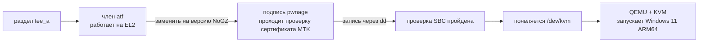

# Windows 11 ARM64 на Android-смартфоне — с настоящим аппаратным ускорением KVM

[中文](README.md) | [English](README.en.md) | [日本語](README.ja.md) | **Русский**

> Проверено на реальном устройстве Redmi Note 11T Pro+ / **Redmi K50i** (MT6895 / Dimensity 8100).
> **Redmi Note 11T Pro / POCO X4 GT** (кодовое имя `xaga`) из того же семейства SoC работает по тому же
> принципу, но прошивка отличается, поэтому нужен свой profile (можно сначала сделать бэкап и попробовать
> готовые образы — загрузка «от другой базы» проверена измерениями).
> **Не нужно перепрошивать телефон и не нужно менять ОС — оставайтесь на Android и запускайте виртуальные машины.**

---

> # ⚠️ Сначала о позиционировании: это **игрушка / эксперимент**, **не для основной машины**
>
> Цена включения KVM — **аппаратное декодирование видео перестаёт работать** ✗ — измерено:
>
> | | До записи | После записи | После отката |
> |---|---|---|---|
> | Стриминг Moonlight | ✅ | ❌ **нет отклика** | ✅ восстановлено |
> | UU Remote | ✅ | ❌ **не работает** | ✅ восстановлено |
> | Изображения в QQ | ✅ | ❌ **не отображаются** | ✅ восстановлено |
> | Внутреннее хранилище | ✅ | ⚠️ может не смонтироваться при загрузке | ✅ восстановлено |
> | Данные приложений | ✅ | ⚠️ могут быть повреждены | —— |
>
> **Откат возвращает всё** ✓ (измерено)
>
> | | |
> |---|---|
> | ❌ **Не подходит** | для повседневного основного телефона |
> | ✅ **Подходит** | второй телефон / тестовый / выделенный под виртуальные машины |
> | ✅ **Или** | принять, что «аппаратное декодирование недоступно» |
> | ✅ **Хочется и то и то** | идите путём [mainline Linux](docs/06-mainline.md) |
>
> **Точный механизм**: venc / vdec от MTK при `open()` используют **IPI к сопроцессору VCP, чтобы запросить
> «поддерживаемые размеры кадра»**, а **рукопожатие READY у VCP зависит от цепочки EL2 / защищённого мира**.
> Когда ядро Android поднимается на EL2 (это обязательное условие для KVM), рукопожатие рвётся
> → таблица размеров приходит пустой → `configure()` в Codec2 возвращает `EINVAL`
> → и **фреймворк/приложения НЕ переключаются на программное кодирование** ✗ → `screenrecord` даёт файл в 0 байт ✗
> (узел `/dev/vdec-fmt` и есть та самая таблица размеров кадра; программные кодеки не идут через VCP и не затронуты)
>
> ⚠️ **Это не связано с совпадением базы** ✗ — патч под ту же базу делает то же самое ✓
> **Пока KVM присутствует, аппаратные кодеки непригодны — это неотъемлемая цена патча tee, её нельзя обойти** ✗
>
> Полные измерения и откат: [docs/05-gotchas.md пункт 14](docs/05-gotchas.md)


---

## ⚠️ **Три** вещи, которые нужно знать до начала

### 1. Нужны права root (обойти нельзя)

Чтобы QEMU на Android использовал **аппаратное ускорение KVM**, необходимо заменить
прошивку ATF, работающую на уровне EL2 внутри раздела `tee`. Для этого требуется:

- ✅ **Разблокированный загрузчик**
- ✅ **Полученный root** (KernelSU / Magisk, с выданным доступом для `adb shell`)
- ✅ **adb** и **Python 3.10+** на ПК

> **Нет root — нет KVM.** Все «виртуальные машины без root» из интернета используют
> **TCG (чистую программную эмуляцию)** — это примерно **1/10…1/50** от скорости KVM.
> Установка ОС занимает часы, для повседневной работы это непригодно.
> **Этот проект работает только через KVM. TCG не рассматривается.**

### 2. Это изменяет цепочку доверия устройства

Замена ATF — это **модификация цепочки загрузки**. Всё в проекте проверено на реальном
железе, но вы должны понимать:

- **Обязательно сделайте резервную копию штатного `tee_a`** (скрипт в один клик требует этого и прерывается, если копию снять не удалось)
- **Изменяется только `tee_a`, `tee_b` остаётся штатным** — переключение на слот B возвращает устройство в состояние без KVM, это встроенная страховка
- **Не используйте SP Flash Tool для полной прошивки** (он заново блокирует загрузчик)
- Если всё-таки «убьёте» устройство, всё ещё возможен режим **preloader** (без авторизации)
- **Вся ответственность на вас**

### 3. ⭐ Перед тем как пробовать `tee`, прошейте **инженерный preloader** — это единственный путь восстановления без авторизации

**Это важнее резервной копии** ✗:

```
Штатный preloader       => для EDL нужна авторизация учётной записи сервисного центра Xiaomi ✗
                        => если tee неверный и устройство не грузится, пути без авторизации НЕТ ✗

Инженерный preloader    => возвращаемое значение usbdl_verify_da отбрасывается
                        => проверки SLA / DAA фактически обойдены
                        => SP Flash / mtkclient могут писать БЕЗ учётной записи ✓
                        => это и есть настоящее условие для «сломается — восстановишь» ✓
```

**Прошивка инженерного preloader (fastboot достаточно — намного проще, чем `tee`)**:

```bash
fastboot flash preloader1 preloader_xaga.bin
fastboot flash preloader2 preloader_xaga.bin
fastboot reboot
```

(На этом устройстве это by-name разделы `preloader_raw_a` / `preloader_raw_b`.)

> ⚠️ Инженерный preloader снимает авторизацию **только для ЗАПИСИ** и **НЕ отключает проверку образа при
> загрузке** ✗. `sbc_en` по-прежнему читается из eFuse и равен **1**, ATF всё так же проверяется при каждой
> загрузке ✓ Поэтому «изменённый ATF обязан быть подписан» остаётся в силе — см. [docs/05](docs/05-gotchas.md)
> и [appendix-atf-reverse](docs/appendix-atf-reverse.md).

**→ Рекомендуемый полный порядок**:

```
1) Убедитесь, что можете прошить инженерный preloader (файл есть + fastboot / SP Flash работают)
2) Прошейте и убедитесь, что устройство нормально загружается
3) Сделайте бэкап: tee_a / tee_b / lk_a / lk_b / preloader_raw_a / seccfg
4) И только потом пробуйте готовые образы `tee` из этого проекта
```

---

## Кому это подходит

| Ваша ситуация | Рекомендация |
|---|---|
| **Хотите остаться на Android**, просто нужна ВМ с Windows / ARM Linux | ✅ **Это и есть проект** — см. [Быстрый старт](#быстрый-старт) |
| Хотите **mainline Linux + KDE** (как в видео [kde-yyds](https://space.bilibili.com/2008726064)) | См. [docs/ru/06-mainline.md](docs/ru/06-mainline.md) |
| Нет root | ❌ Проект не поможет (TCG не обсуждается) |
| Устройство не на MT6895 | ⚠️ Идея общая, но патч `tee` требует пары TEE/LK именно вашей модели (см. [docs/02](docs/ru/02-build-and-sign.md)) |

---

## Принцип в одном предложении

На устройствах MediaTek `/dev/kvm` отсутствует потому, что **EL2 занят прошивкой
GenieZone (GZ) от MediaTek**. Замените **ATF**, работающий на EL2 внутри раздела `tee_a`,
на **версию с патчем NoGZ** (подписанную так, чтобы пройти проверку сертификата MTK) —
и **EL2 перейдёт к Linux** → появится `/dev/kvm` → QEMU сможет использовать KVM.



**Почему подпись обязательна**: на устройстве измерено `sbc_en = 1` (Secure Boot включён,
значение берётся из eFuse OTP и не может быть изменено). При каждой загрузке проверяется
цепочка сертификатов ATF, поэтому изменённый ATF принимается только если он **подписан
с использованием уязвимости разбора сертификатов в
[pwnage24mtk](https://github.com/kasnria001/pwnage24mtk)**.
Подробности — в [docs/01](docs/ru/01-enable-kvm.md) и [docs/02](docs/ru/02-build-and-sign.md).

---

## 🎁 Не хотите собирать сами? Возьмите готовый образ

В репозитории лежат **уже собранные и подписанные** образы `tee`, которые можно записывать
напрямую —**включая пример, подтверждённый на реальном железе**:

| Файл | Совместимая база (ваш `tee_a`) | Проверка на железе |
|---|---|---|
| [`tee/tee_nogz_rk_5M.img`](tee/tee_nogz_rk_5M.img) | `f8f286f1…` (штатная) | ✅ **работает** (подтверждено дважды, через Android 15 → 16) |
| [`tee/tee_nogz_shuilanA15_5M.img`](tee/tee_nogz_shuilanA15_5M.img) | `a91f5ded…` (после обновления ROM) | ✅ **работает** (измерено 2026-10-06) |

**Перед записью запустите самопроверку** — она скажет, какой образ подходит (или что нужно собрать свой):

```bash
bash tee/verify.sh                 # автоматически определит подключённое устройство
bash tee/verify.sh <serial>        # или укажите устройство явно
```

Скрипт выведет `tee_a` / `tee_b` вашего устройства и различит три состояния:
**не пропатчено / уже пропатчено / нужно собрать самому**.

⚠️ **Патч собран под конкретную базу `tee`** — предпочтительнее патч под вашу базу (консервативнее,
> меньше переменных). **Но патч от другой базы тоже загружается** ✓ (измерено 2026-10-07):
> он просто сначала стоит на втором экране 1–2 минуты — дайте ему 3 минуты.
>
> ⚠️ **Каждая загрузка после записи висит на втором экране около 1–2 минут**, прежде чем дойти до
> системы — это нормально, **это не кирпич, просто подождите**. Не торопитесь в fastboot:
> это прервёт загрузку.
>
> ⚠️ **Влияет ли запись на повседневные проверки целостности приложений (банковские приложения /
> Play Integrity / DRM)? Измеренный ответ: нет** — патч меняет только владельца EL2 и никогда не
> касается TEE. Полные измерения, таблица совместимости баз и процедура отката — в
> [`tee/README.ru.md`](tee/README.ru.md).

---

## Быстрый старт

### Шаг 1. Включить KVM (скрипт в один клик)

```powershell
# Подготовьте два инструмента (скачиваются отдельно)
git clone https://github.com/MT6895-Mainline/mtk-mod-tee-nogz   D:\mtk-mod-tee-nogz
git clone https://github.com/kasnria001/pwnage24mtk             D:\pwnage24mtk

# Установите зависимости mtk-mod-tee-nogz
cd D:\mtk-mod-tee-nogz
python -m venv .venv
.\.venv\Scripts\python.exe -m pip install -r requirements.txt

# Всё за один прогон: проверка окружения → резервная копия → dump → сборка → подпись → проверка → запись → подсказки
cd <этот репозиторий>\scripts
.\kvm-oneclick.ps1 -Profile xaga -TeeFixRepo D:\mtk-mod-tee-nogz -PwnageDir D:\pwnage24mtk
```

Скрипт проходит следующие этапы, **на каждом печатая результат и выполняя проверки**:

```
[1] проверка окружения   adb / python / устройство / разблокировка BL / root
[2] разведка (только чтение)  модель, разделы, состояние /dev/kvm, sbc_en из expdb
[3] резервные копии      tee_a / tee_b / lk_a / lk_b / preloader_raw_a / seccfg → на ПК
[4] снятие материала     TEE / LK / preloader прямо с устройства (гарантия совпадения хешей)
[5] сборка + подпись     вызывает mtk-mod-tee-nogz (автоопределение режима new/legacy)
[6] проверка             требует 2× «Result: VALID»; обрезает хвостовое заполнение нулями до размера раздела
[7] запись в tee_a       dd + чтение обратно и сравнение sha256
[8] подсказки по перезагрузке  /dev/kvm, «[SBC] image atf header auth pass»
```

**Хотите сначала посмотреть, ничего не записывая?** Добавьте `-DryRun` — скрипт дойдёт
до шага 6 и оставит готовый к записи образ на диске.

После записи перезагрузитесь и проверьте:

```bash
adb shell su -c 'ls -l /dev/kvm'
adb shell su -c 'cat /proc/misc | grep kvm'
```

> ### ⚠️ **Каждая загрузка после записи** висит на втором экране 1–2 минуты — это не «кирпич»
>
> Измерено: от перезагрузки до `sys.boot_completed=1` прошло **150 секунд**, из них
> 120 секунд экран вообще не менялся. После этого `/dev/kvm` появляется нормально ✓
>
> **Не нажимайте** в этот момент «Громкость вниз + Питание» для входа в fastboot ✗ —
> **это прервёт загрузку** и превратит загрузку, которая бы завершилась успешно, в реально
> незагружающееся устройство ✗. **Подождите 3 минуты** ✓
>
> Как отличить: **второй экран + устройство видно в adb = нормально, ждите** ✓;
> **первый экран, либо чёрный экран с падением в fastboot = реальный сбой** ✗.
> Подробности — пункт 12 в [docs/05](docs/ru/05-gotchas.md).

### Шаг 2. Создать диск Windows 11 ARM64 (скрипт в один клик)

Не нужно устанавливать гипервизор и не нужно запускать установщик внутри ВМ — загрузочный
VHDX собирается прямо из ISO, полностью из командной строки:

```powershell
# Извлечь драйверы virtio для ARM64 (нужен 7-Zip)
.\extract-virtio.ps1 -Iso D:\virtio-win.iso -OutDir .\virtio-arm64-w11

# Собрать диск прямо из ISO Windows 11 ARM64
# (запускать в PowerShell от имени администратора)
.\build-windows-vhdx.ps1 -Iso D:\Win11_ARM64.iso -DriversDir .\virtio-arm64-w11
```

Скрипт делает всё сам: разметка → `dism /Apply-Image /Compact:ON` →
**запись загрузочных файлов через `bcdboot`** → **обход проверок TPM через LabConfig** →
**внедрение драйверов** → проверка, что `bootmgfw.efi` действительно ARM64.

> ⚠️ Самая частая ловушка здесь: у дисков, полученных инструментами вроде Dism++,
> **ESP пустой**. Нужно самостоятельно выполнить `bcdboot`, иначе прошивка не найдёт
> загрузочное устройство.

### Шаг 3. Скопировать на телефон и запустить

```bash
# Сначала закиньте скрипты для телефона (они лежат в scripts/phone/)
adb push scripts/phone/boot-win.sh scripts/phone/stop-vm.sh scripts/phone/restore-disk.sh /data/local/tmp/
adb shell su -c 'chmod 755 /data/local/tmp/*.sh'

# Положите диск на место (restore-disk.sh проверит формат, свободное место и sha256)
adb push win.vhdx /data/local/tmp/win.vhdx
adb shell su -c 'sh /data/local/tmp/restore-disk.sh /data/local/tmp/win.vhdx'

# Запуск (скрипт сам дождётся освобождения порта 5900 и перепроверит фактический порт)
adb shell su -c 'sh /data/local/tmp/boot-win.sh'
adb forward tcp:5900 tcp:5900                    # VNC жёстко на 5900
# VNC-клиент подключается к 127.0.0.1:5900 (без пароля)
```

> Потеряли диск или переходите на новый? Просто выполните `restore-disk.sh <образ>` —
> скрипт определит формат (VHDX / QCOW2 / VHD), проверит свободное место на `/data`,
> спросит подтверждение перед перезаписью и в конце проверит sha256.

Первая загрузка запускает OOBE и занимает 5–15 минут. На странице сети выберите
**«У меня нет интернета»** → **«Продолжить с ограниченной настройкой»**, чтобы создать
локальную учётную запись — это самый простой путь.

---

## Навигация по репозиторию

| Файл | Содержание |
|---|---|
| [README.en.md](README.en.md) | Английская версия README |
| [README.ja.md](README.ja.md) | Японская версия README |
| [docs/ru/01-enable-kvm.md](docs/ru/01-enable-kvm.md) | **Полный процесс включения KVM**: принцип, разбор цепочки проверок, запись и верификация |
| [docs/ru/02-build-and-sign.md](docs/ru/02-build-and-sign.md) | **Подробно о сборке и подписи**: что меняет патч NoGZ, как подписывает pwnage, что делать с превышением размера |
| [docs/ru/03-windows-vm.md](docs/ru/03-windows-vm.md) | Диск Windows 11 ARM64: развёртывание образа, загрузочные файлы, обход TPM, внедрение драйверов |
| [docs/ru/04-usage.md](docs/ru/04-usage.md) | **Использование**: разбор каждого параметра QEMU, VNC, сеть, тюнинг производительности |
| [docs/ru/05-gotchas.md](docs/ru/05-gotchas.md) | **Список подводных камней** (12 пунктов, все реально пройдены) |
| [docs/ru/06-mainline.md](docs/ru/06-mainline.md) | Продвинутый путь: mainline Linux + KDE |
| [tee/](tee/) | **Готовые образы `tee`** (подписанные, можно записывать) + таблица совместимости баз |
| [profiles/](profiles/) | Профили прошивок (определения смещений ATF/LK) |
| [tools/](tools/) | Инструменты реверс-инжиниринга для переноса смещений на новые прошивки |
| [scripts/](scripts/) | Скрипты в один клик (сборка VHDX / извлечение драйверов / включение KVM) |
| [scripts/phone/](scripts/phone/) | **Скрипты для телефона**: `boot-win.sh`, `stop-vm.sh`, `restore-disk.sh`, `qemu-wrapper.sh` |

---

## Частые вопросы

**Q: Не получается подключиться по VNC**

Разбирайте два случая отдельно.

**① Запуск через `boot-win.sh` из этого проекта (путь командной строки)**
> В `-vnc host:N` у QEMU число `N` — это **номер display**, а порт равен `5900 + N`.
> Если написать `-vnc :5900`, реально будет слушаться **11800**, а не 5900.
> Хуже того, если порт занят, QEMU **не выдаёт ошибку, а молча переходит к следующему
> display** (→ 5901). Поэтому `scripts/phone/boot-win.sh` сначала ждёт освобождения порта,
> а после запуска перепроверяет, какой порт реально занят.

**② Запуск через собственную конфигурацию приложения DroidVM**
> Здесь есть ещё две ловушки:
> - В `vms.json` значение `screens.*.vnc.port` по умолчанию **`-1`**, то есть «выбрать
>   автоматически» —— **порт может отличаться при каждом запуске** ✗, и то, что вы
>   пробросили через `adb forward tcp:5900`, никто не слушает
> - Конфигурация, созданная самим приложением, **сама по себе не работает** (нет `-netdev`
>   и balloon — их нужно добавлять скриптом-обёрткой), а **правка `vms.json` вручную
>   приводит к тому, что приложение не может его прочитать** ✗
>
> **Поэтому проект использует путь командной строки**: порт жёстко 5900, полный контроль
> над аргументами. Подробности — в [scripts/phone/README.md](scripts/phone/README.md).

**Q: Есть ли в Windows аппаратное ускорение GPU?**
> **Нет, это принципиальное ограничение.** `viogpudo` из virtio-win — это драйвер
> отображения, **без 3D-возможностей**; драйвера virgl для Windows тоже не существует
> (он есть только для Linux). Поэтому гость с Windows всегда рендерится программно.
> Нужна ВМ с GPU-ускорением — идите путём [mainline Linux](docs/ru/06-mainline.md) с гостем Linux.

**Q: Всё тормозит, что делать?**
> Основное — это **путь отображения**. Добавление `-vnc ...,lossy=on` уменьшает объём
> данных на кадр с 3.0 MB до **0.36 MB (в 8.3 раза)**. Кроме того, туннель через adb
> измерен на **276 MB/s**, так что сеть не является узким местом — не тратьте время на неё.
> Подробности — в [docs/04](docs/ru/04-usage.md).

**Q: Можно ли без root?**
> Нет. Без root нельзя изменить `tee_a`, а значит не будет KVM. См. предупреждение выше.

**Q: Можно ли использовать другую версию Windows?**
> Нужна версия **ARM64**. x64 на ARM работает только через эмуляцию (крайне медленно),
> смысла в этом нет.

**Q: Повлияет ли запись `tee` на повседневные проверки целостности приложений (банковские приложения / Play Integrity / DRM)?**
> **Нет — проверено на реальном железе.** Патч меняет только **владельца EL2** и не касается **TEE**.
> Сравнение A/B (штатное / пропатченное) дало идентичные результаты: аппаратная аттестация ключей
> KeyMint, Gatekeeper, Widevine/DRM, отпечаток и распознавание лица, Secure Element — **всё работает**.
>
> Отдельно стоит различать: **`verifiedbootstate = orange` (разблокированный загрузчик) сам по себе
> убивает Play Integrity** и не связан с записью `tee` — эти проверки и так не проходят, поэтому
> запись не может сделать хуже. Полные измерения — в разделе про проверки целостности в
> [tee/README.ru.md](tee/README.ru.md).

**Q: Повлияет ли запись `tee` на проверки приложений (банковские приложения, Play Integrity, DRM)?**
> **Нет, проверено на реальных устройствах.** Патч меняет только **владельца EL2** и не
> касается **TEE**. Сравнение A/B (штатное / пропатченное) дало идентичные результаты:
> аппаратная аттестация ключей KeyMint, Gatekeeper, Widevine/DRM, отпечаток и распознавание
> лица, Secure Element — **всё работает**.
>
> Отдельно стоит различать: **`verifiedbootstate = orange` (разблокированный загрузчик)
> сам по себе убивает Play Integrity** и не связан с записью `tee` —
> эти проверки и так не проходят, поэтому запись не может сделать хуже.
> Полные измерения — в соответствующем разделе [tee/README.md](tee/README.md).

---

## Благодарности

- [`MT6895-Mainline`](https://github.com/MT6895-Mainline) — проект mainline-порта для этого устройства и источник инструментов патча NoGZ
- [`mtk-mod-tee-nogz`](https://github.com/MT6895-Mainline/mtk-mod-tee-nogz) — инструмент сборки и подписи патча ATF NoGZ (скрипт в один клик оборачивает его)
- [`kasnria001/pwnage24mtk`](https://github.com/kasnria001/pwnage24mtk) — обход подписи сертификатом MTK
- [kde-yyds](https://space.bilibili.com/2008726064) — хроника mainline Linux на том же устройстве, источник вдохновения

## Лицензия

**Код, скрипты и документация** этого репозитория распространяются под [лицензией MIT](LICENSE).

> ⚠️ Образы прошивок производителя в [`tee/`](tee/) (содержащие бинарники и цепочки
> сертификатов MediaTek и производителя устройства) **не покрываются лицензией MIT**.
> Они предоставлены исключительно для исследования совместимости на принадлежащем вам
> оборудовании.
